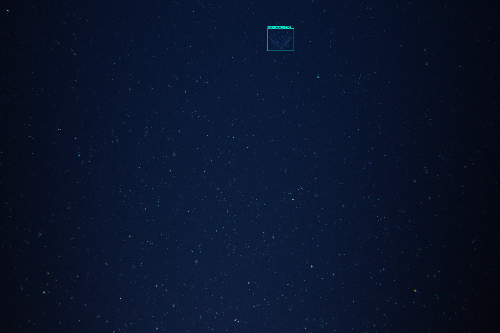
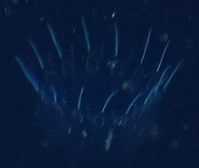

# Micronekton Detection Documentation 

## Steps for deployment of FathomNet model 

[FathomNet/MBARI-midwater-supercategory-detector](https://huggingface.co/FathomNet/MBARI-midwater-supercategory-detector)

### Create and activate Conda environment

> in a terminal window
  
```
$ module use /g/data/hh5/public/modules
$ module load conda/analysis3
$ python3 -m venv NAME_OF_ENVIRONMENT --system-site-packages 
$ source NAME_OF_ENVIRONMENT/bin/activate
```

> install any missing libraries

```
$ (NAME_OF_ENVIRONMENT) $ pip install ultralytics
```

### Clone `yolov5` into the Conda environment

> in a terminal window

```
$ git clone https://github.com/ultralytics/yolov5
$ cd yolov5/
$ pip install -r requirements.txt
```

#### Check that `yolov5` has been cloned and all packages are working in your Conda environment

```
$ cd (NAME_OF_ENVIRONMENT)
$ python
>>> import torch
>>> model = torch.hub.load("ultralytics/yolov5", "yolov5s")  
```

### Prepare to run the model

* download [weights file]('https://huggingface.co/FathomNet/MBARI-midwater-supercategory-detector/blob/main/best.pt')

* upload imagery to run against model and copy this path (to your imagery) 

### Run the model 

> in a terminal window

```
$ cd NAME_OF_ENVIRONMENT
$ source bin/activate
$ cd ../yolov5/
$ python detect.py --weights /path/to/best.pt --source /path/to/images-or-video --save-txt --save-csv --save-crop
```

### Outputs

* original images with bounding box predictions



* .crops of predicted classes for each image

 

* .txt file with all the bounding box information for each image

* csv file with predictions and confidence levels for each image

> #### Outputs saved into ..yolov5/runs/detect/exp(n) where n is the run number
>
> ##### To change the location of the outputs, in the yolov5 dir

```
$ cd runs/detect/
$ rsync -ravzP ./exp /path/to/DESTINATION
```


