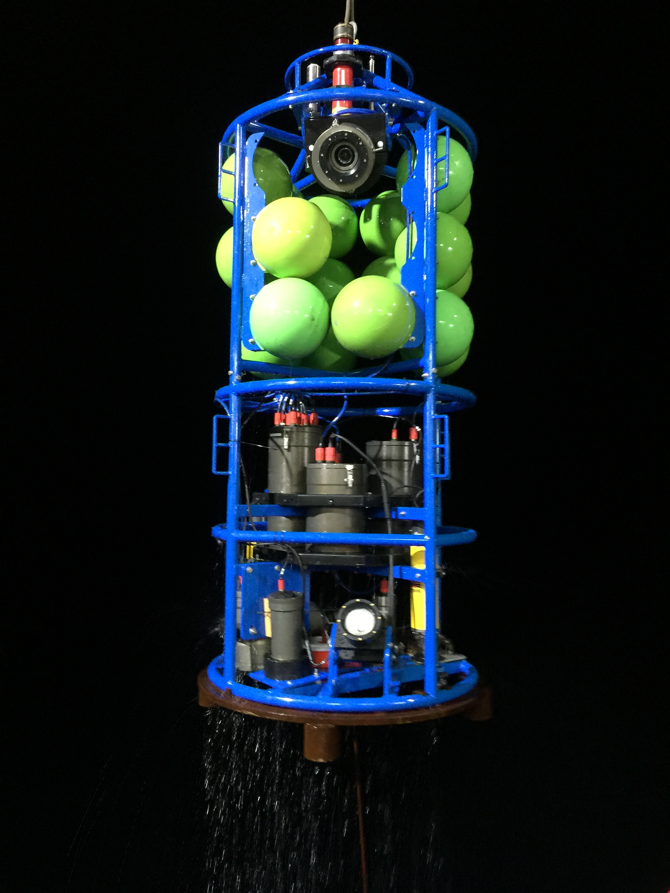

# ohw24_proj_micronekton_img_pipeline_au

## Project Name

Micronekton Imagery Pipeline + AI

## Collaborators

| Name                | Location   | Role                |
|---------------------|------------|---------------------|
| Ryan Downie       | Australia    | Project Leader |
| Bowen Zhang       | Australia    | Contributor         |
| Reg  Dowse      | Australia    | Contributor         |
| Candice Untiedt      | Australia    | Contributor       |

## Background
The PLAOS platform used by CSIRO collects vertical profile data through the water column including physical, acoustic and imagery data. 

## Goals

1. Interface with the marimba platform by developing a PLAOS pipeline to manage and process data. Marimba is a Python framework designed for efficient processing of FAIR (Findable, Accessible, Interoperable, and Reusable) scientific marine image datasets.  

2. Apply an an existing AI-ML model [FathomNet/MBARI-midwater-supercategory-detector](https://huggingface.co/FathomNet/MBARI-midwater-supercategory-detector) to imagery from the oblique camera in order to detect midwater faunal classes and develop a mosaic of images for the detected classes. 

## Datasets

1. PLAOS data: acoustic, imagery (vertical stereo cameras and oblique camera) and log data
  
2. Oblique imagery from IN2020_V08

## Results/Findings

2. The [FathomNet/MBARI-midwater-supercategory-detector](https://huggingface.co/FathomNet/MBARI-midwater-supercategory-detector) was successfully run on oblique camera stills imagery from 15 stations (subset) to detect 16 faunal classes.

### Outputs 

> a.  Original image with bounding box predictions

> b. Cropped bounding box of predicted classes for each image

 

> c. .txt file with all the bounding box information for each image

[link to text file for this image](/Images/OBL00162.txt)

> d. csv file with predictions and confidence levels for each image in the processed batch

[link to csv file for processed images in this batch](/Images/predictions.csv)

> e. mosaic of detected class images for each station, arranged by class and including a text overlay

